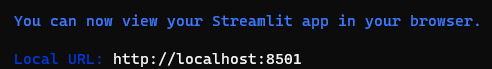
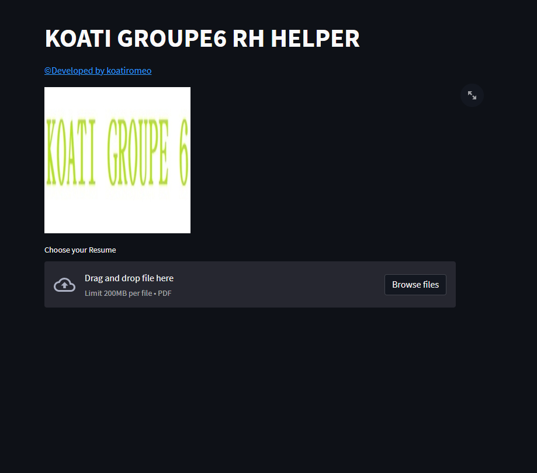
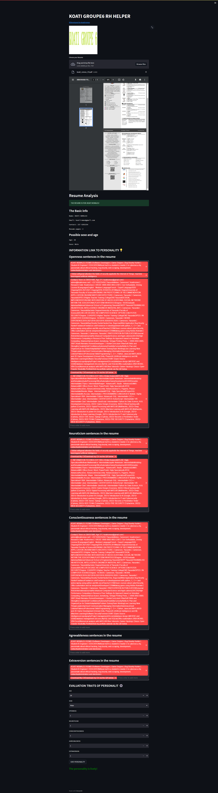

# Personality-resume-analysis-using-NLP
The applcation help to determined the personality of a resume with the giving of some features

# Pre-requirement
Python Version 3 

# Cloning the projet 
git clone https://github.com/koatiromeo/Personality-resume-analysis-using-NLP.git  
cd Personality-resume-analysis-using-NLP  

# Installing Dependencies packages
python -m pip install -r requirements.txt  
python -m pip install https://github.com/explosion/spacy-models/releases/download/en_core_web_sm-2.3.1/en_core_web_sm-2.3.1.tar.gz  
python  
import nltk  
nltk.download('stopwords')  
nltk.download('punkt')  

# Run the Application 
python -m streamlit run App.py
## Result after the running command

## Execution In the browser :

## After Loading of a resume:
